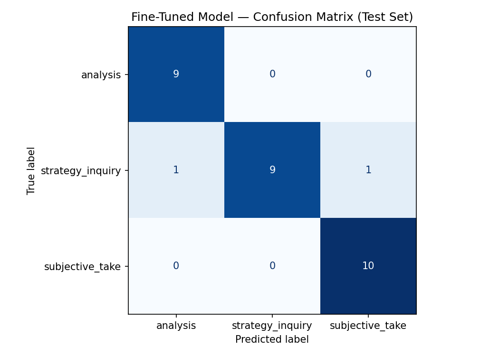

# ai201-project3-takemeter

# TakeMeter: `r/pokemon` Discourse Classifier

## 1. Community Choice and Reasoning

**Community:** `r/pokemon` (Reddit)
My community is the Reddit Pokémon community (r/pokemon). This is a highly opinionated community that spans gameplay information, subjective takes, inquiries on strategies, and more. Given the varying quality of discourse, it is a great choice to be able to distinguish, especially for readers that are looking for a specific piece of information or simply want to share their opinions.

## 2. Label Taxonomy

The taxonomy divides discourse into three mutually exclusive categories:

subjective_take A post making a bold claim or critique based entirely on personal feeling, nostalgia, or aesthetic preference without verifiable evidence.

Example 1: "Gen 1 has the best starters, you can't beat the classics that look like actual monsters."
Example 2: "Yeah, a decent amount of people who've been around since before Gen 6 attribute the fact that Pokemon in general started going downhill once they transitioned from 2D to 3D. It's not really a hot take, more of a well-known take."
analysis A post that makes an argument supported by specific, verifiable evidence—like citing base stats, quoting specific game text, or doing competitive math.

Example 1: "Not sure if this is a hot take, but Ice should resist Water and Dragon. It shouldn't get a defense buff in Snow though. Aurora Veil exists and we don't want to make Ice Pokemon on the snow even bulkier when they can already freeze you to death with 100% Blizzard spam."
Example 2: "HM's used to be important parts of puzzles and dungeons. None of those things exist in the recent games. I miss the obnoxious 'move these boulders in the right order' aspect of things. It gave players a reason to go back to areas they've already visited. Turning HM's into simple keys you carry removes the strategy that comes with dungeon diving and team building."
strategy_inquiry A post actively soliciting help, team-building advice, or asking a direct question about how to overcome an in-game obstacle.

Example 1: "I'm stuck on Cynthia's Garchomp in BDSP. My current team is Empoleon, Staraptor, Luxray, Rapidash, Roserade, and Lucario. Should I swap out Luxray for a dedicated Ice type like Weavile, or just try to overlevel my Empoleon so it can tank a hit?"
Example 2: "Need help building a VGC Reg F team around Walking Wake. I know setting up Sun is mandatory, so I'm running Torkoal, but I keep getting completely walled by Flutter Mane. Any advice on specific EV spreads or good defensive pivots I should add?"

## 3. Data Collection, Labeling, and Edge Cases

**Collection & Source:**
A dataset of 200 posts was curated to reflect real-world `r/pokemon` data. There were issues with the data being too "easy" for the model and I had to choose more chaotic examples that mimicked the realistic poorly written style of most social media posts, with grammar errors, run on sentences, and lots of slang.  By stress testing it, I got more realistic results with some mistakes, so it was not 100% perfect!

**Label Distribution:**

* `strategy_inquiry`: 76
* `subjective_take`: 67
* `analysis`: 57

**Difficult-to-Label Examples (Edge Cases):**

1. *"charizard is overrated trash but u gotta admit solar power in sun giving a 1.5x sp attack multiplier actually lets it 2HKO toxapex with fire blast which is insane"*
* **Decision:** `analysis`. Despite starting with a subjective rant ("overrated trash"), the core argument relies entirely on verifiable competitive mathematics.

2.  *"bro honestly the vibes in the new region are just completely off like 0/10 energy it feels like a weird mobile game from 2012 and nobody can convince me otherwise"*
* **Decision:** `subjective_take`. It uses numbers ("0/10"), but they represent purely emotional/subjective metrics, not game mechanics.

3.  *"im literally losing my mind gamefreak hates us the elite four is actually cheating this time how tf are u guys getting past the steel user without a fire mon do i need to go back and catch a houndoom or what"*
* **Decision:** `strategy_inquiry`. It reads like an 80% subjective rant, but the fundamental intent is a direct plea for team-building help to overcome a wall.

## 4. Fine-Tuning Approach & Hyperparameter Decisions

* **Base Model:** `distilbert-base-uncased` via HuggingFace.
* **Training Setup:** Fine-tuned via Google Colab on a free T4 GPU using a 70/15/15 train/validation/test split.
* **Key Hyperparameter Decision:** The default settings (3 epochs, `2e-5` learning rate) resulted in underfitting (0.833 accuracy) and low confidence scores (0.35 range), indicating the model was just guessing, since it was approx 1/3.  I increased the learning rate to `2e-4` and bumped the epochs to `4`. This allowed the model to rapidly adapt to the messy internet slang, spiking accuracy to **0.933**. However, pushing to 5 epochs caused the validation loss to increase and accuracy to drop (0.76), proving that 4 epochs was the absolute mathematical sweet spot to prevent overfitting.

## 5. Baseline Description

* **Model:** Groq `llama-3.3-70b-versatile`
* **Prompting:** Used a strict zero-shot prompt providing the community context, the three exact label names, their one-sentence definitions, and one example each. The model was instructed to output ONLY the label string.
* **Execution:** Run natively in the Colab notebook with a 0.1s delay to respect API rate limits.

## 6. Full Evaluation Report

### Overall Metrics

| Model | Accuracy |
| --- | --- |
| Zero-shot Baseline (Groq 70B) | 0.967 |
| Fine-tuned DistilBERT (66M) | 0.933 |

### Per-Class Metrics (Fine-Tuned Model)

| Label | Precision | Recall | F1-Score | Support |
| --- | --- | --- | --- | --- |
| `analysis` | 0.90 | 1.00 | 0.95 | 9 |
| `strategy_inquiry` | 1.00 | 0.82 | 0.90 | 11 |
| `subjective_take` | 0.91 | 1.00 | 0.95 | 10 |

### Confusion Matrix

| True \ Predicted | `analysis` | `strategy_inquiry` | `subjective_take` |
| --- | --- | --- | --- |
| **`analysis`** | 9 | 0 | 0 |
| **`strategy_inquiry`** | 1 | 9 | 1 |
| **`subjective_take`** | 0 | 0 | 10 |

### Failure Analysis (Wrong Predictions)

The fine-tuned model achieved 93.3% accuracy, missing only 2 out of 30 test cases. A third failure mode (plus quite a lot more!) was identified during the 3-epoch underfitting stage.

1. **(True: `strategy_inquiry` | Predicted: `analysis`)**
* *Text:* "currently getting walled by blissey on showdown what physical attacker completely shreds stall teams without getting ruined by toxic on the switch in"
* *Analysis:* The model got distracted by the dense meta-game terminology ("walled by blissey", "physical attacker", "toxic on the switch"). Because that vocabulary heavily skewed toward `analysis` in the training data, the model ignored the structural plea for help ("what physical attacker completely shreds...").

2. **(True: `strategy_inquiry` | Predicted: `subjective_take`)**
* *Text:* "Like should I immediately buy this game. It seems like folks are really enjoying it but I was skeptical."
* *Analysis:* There is a question, but it violates the strict definition of `strategy_inquiry` ("how to overcome an *in-game* obstacle"). Purchasing the game is not an in-game obstacle, which should have been better explained in the labels. The model latched onto emotional words ("enjoying", "skeptical") and threw it into `subjective_take`.

3. **The Rhetorical Question Trap (Identified during early epochs)**
* *Text:* "why does every new legendary look like a digimon or a transformer now"
* *Analysis:* This came from the previous iteration with a lower epoch level.  It frequently classified angry `subjective_takes` as `strategy_inquiries` simply because they started with the word "why." The 4-epoch model successfully unlearned this rigid dependency on question words with a higher learning rate.

### Sample Classifications

| Text | True Label | Predicted Label | Confidence |
| --- | --- | --- | --- |
| *gen 3 trumpets go incredibly hard. best ost period.* | `subjective_take` | `subjective_take` | 0.98 |
| *Like should I immediately buy this game. It seems like folks are really enjoying it but I was skeptical.* | `strategy_inquiry` | `subjective_take` | 0.93 |
| *burn halves physical damage output. its not just about the tick damage at the end of the turn, it functions like a permanent reflect* | `analysis` | `analysis` | 0.99 |
| *what is the best eeveelution to use for a casual fire red run? i have a blastoise already so vaporeon is out. jolteon or flareon?* | `strategy_inquiry` | `strategy_inquiry` | 0.97 |

*Note on Correct Example 4:* The model correctly identified this as a `strategy_inquiry` with 97% confidence because it perfectly matches the structural intent of asking for team-building advice ("what is the best eeveelution to use") specifically to overcome an in-game playthrough.

## 7. Reflection

**Intended vs. Learned:** 
My original label taxonomy was much too centered on the TOPIC of the post (gameplay, anime, etc) resulting in me needing to change it based on the core structural argument (evidence (analysis) vs. emotion (subjective_take) vs. question (strategy_inquiry)). However, the failure analysis reveals that the model heavily over focused on *vocabulary clusters*. It learned that competitive jargon (EVs, Showdown, stall teams) equates to `analysis`, which caused it to misclassify inquiries that simply used high-level competitive language. By having that extra epoch with a slightly higher learning rate it was able to unlearn some of these behaviors and gain a much higher accuracy!

## 8. Spec Reflection

* **Helpful Guide:** The spec explicitly forcing the definition of "Hard Edge Cases" before touching a line of code was helpful. While considering the edge cases, my taxonomy actually changed a few times to become more precise and resulted in more accuracy when passing it through an LLM for initial labeling. Seeing that if the accuracy was too high allowed me to analyze my initial 100% accuracy rate and see that the issue lied in the data that I collected, being too neatly organized into labels.  I needed messier edge cases that once included, resulted in just enough mess ups from the LLM to ensure that it was not a one time success.
**Diverging Case:** While the pipeline mentioned to move to the next stage, when my initial zero-shot baseline scored a suspicious 100% accuracy, instead of just moving on to fine-tuning, I paused the pipeline, and assessed why rather than just accepting it.  I realized I must change my cases to include much messier data, and then re-ran the baseline multiple times until the F1-score dropped. I diverged because stress-testing the taxonomy's breaking points was more valuable than just checking off the baseline step and moving forward.

## 9. AI Usage Statement

* **Adversarial Data Generation:** I directed Gemini to initially label my examples given the label taxonomy, before going over it myself.  If it accurately matched my own labels, that would mean that I had a good system.  However, I soon found it was TOO EASY for the AI, and I needed to include trickier examples riddled with more grammatical errors and messy human speech, rather than just the prime examples I found.  Once I found a good balance that could occasionally stump the AI, I knew it was successful!
* **Failure Pattern Analysis:** I provided my initial 3-epoch DistilBERT output to the AI to help surface why it was failing. The AI identified that confidence scores were hovering at 0.35, revealing the model was blindly guessing rather than making confident errors. I utilized this insight to justify bumping my epochs and learning rate for the final, successful run.
